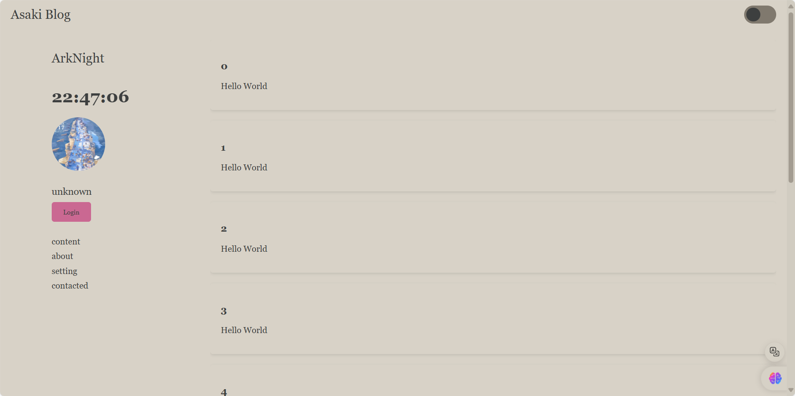
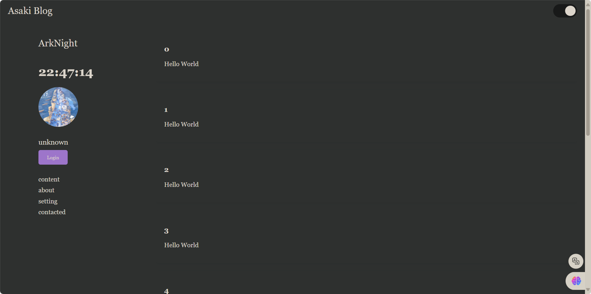

# JavaWeb-Lab

### this is a project which help students to learn how to build a **Web** with html, css, javascript and use java to make server.

***

# How to clone this project ?

1. ### Click the Code button which on the right-top of repository.
2. ### You can select **HTTPS** or **SSH** link to clone it form web to locality.

***
### Light Theme

***

### Dark Theme

